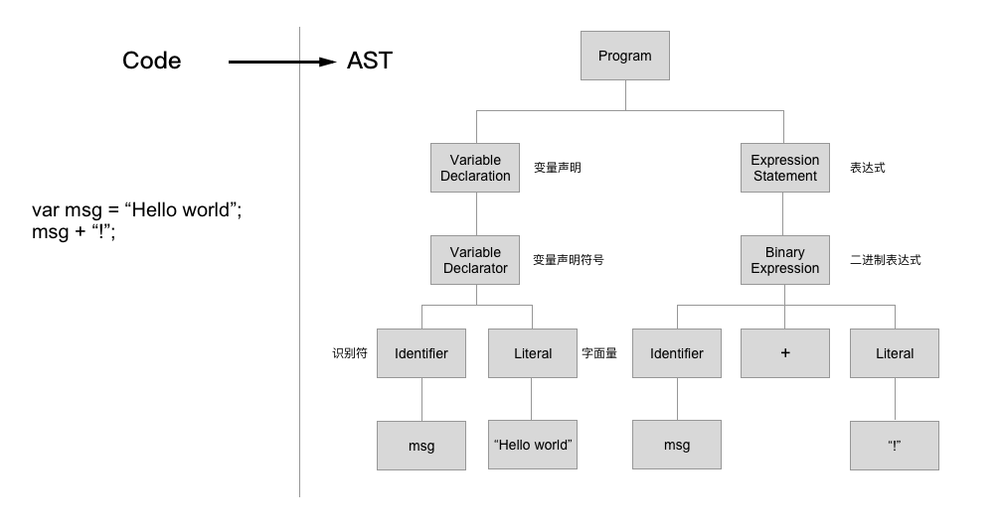

# Babel
Babel 是一个 JavaScript 编译器，它可以让你在编程的过程中使用最新 JavaScript 语法，即使你将代码部署到不支持最新 JavaScript 语法的浏览器或者 Node 环境中。它提供了丰富的工具让你可以享受到最新版本的 JS，将你的代码从“源代码到源代码”的编译后让不同的环境可以运行起来，这种编译被成为**转换编译**。

## Babel 的构成
* 核心包
    * babel-core：转换器核心，调度解析器、翻译器、生成器等
    * babylon：JS 词法解析器，生成 AST
    * babel-traverse：遍历 AST
    * babel-generator：根据 AST 生成代码
* 工具包
    * babel-types
    * babel-template
    * babel-helpers
    * babel-register
    * babel-plugin-xxx
    * babel-polyfill
    * babel-runtime

## 工作原理
Babel 实质上是一个**转换编译器**，它会把高版本的语言翻译成低版本语言，并不像**编译器**那样将一种高级语言翻译成另外一种语言，但是它在转换的过程中也分三个阶段：parsing -> transforming -> generating，以 ES6 代码转换臣 ES5 代码为例：

* babylon 将 **ES6 代码** 解析得到 AST
* babel-traverse 对 AST 树进行翻译，得到 ES5 的 AST
* babel-generator 通过 AST 生成 **ES5 代码**


注意：Babel 只会对新的语法进行翻译，例如：ES6 的箭头函数、 let 声明 等等。但是新的功能或者API，例如：Promise、Set 等 这些都不会翻译。需要我们自己来引入 polyfill 来解决。

### AST 抽象语法树
AST：抽象语法树（Abstract Syntax Tree），指的是源代码语法所对应的树状结构。直接上例子，下图就是代码转向 AST 的过程：



用 JSON 表达出来如下：

```
{
    "type": "Program",
    "body": [
        {
            "type": "VariableDeclaration",
            "declarations": [
                {
                    "type": "VariableDeclarator",
                    "id": {
                        "type": "Identifier",
                        "name": "msg"
                    },
                    "init": {
                        "type": "Literal",
                        "value": "Hello world",
                        "raw": "\"Hello world\""
                    }
                }
            ],
            "kind": "var"
        },
        {
            "type": "ExpressionStatement",
            "expression": {
                "type": "BinaryExpression",
                "operator": "+",
                "left": {
                    "type": "Identifier",
                    "name": "msg"
                },
                "right": {
                    "type": "Literal",
                    "value": "!",
                    "raw": "\"!\""
                }
            }
        }
    ],
    "sourceType": "script"
}
```

* http://esprima.org/demo/parse.html

## 如何使用？
Babel 提供了很多的使用方式，例如：直接引入 babel 脚本让浏览器环境支持最新语法；或者在服务器上全局安装 Babel CLI，让服务器端支持最新语法；当然比较常用的是在构建工具中使用，让代码在转换编译的过程中让其支持最新语法。下面以 Webpack 为例：

* 安装：

```
npm install --save-dev babel-loader babel-core
```

* 配置 Webpack 构建工具：

```
module: {
    rules: [
        { test: /\.js$/, exclude: /node_modules/, loader: "babel-loader" }
    ]
}
```

* 创建 .babelrc 配置文件
配置好后，其实它并没有真的生效，需要在项目中创建 .babelrc 文件并启用一些插件。

首先，我们可以使用转换 ES2015+ 的 env preset：

```
npm install babel-preset-env --save-dev
```

为了让 preset 生效，你需要像下面这样定义你的 .babelrc 文件：

```
{
  "presets": ["env"]
}
```

## presets
配置各种插件是一件非常痛苦的事情，其实 presets 就是各个插件的集合，它可以根据当前的运行环境，自动确定我们需要的插件和polyfills，我们只需要配置需要支持的浏览器和相关版本就行了。

```
{
    "presets": [
        ["env", {
            "targets": {
                "browsers": ["last 2 versions", "safari >= 7"]
            }
        }]
    ]
}
```

具体参考文档：https://babeljs.cn/docs/plugins/preset-env

## babel-polyfill
babel-polyfill 会将 ES2015+ 环境整个引入到你的代码环境中，也就是说你可以直接在代码中使用全新原生对象和API。如果使用，你可以选择在程序入口全部引入，或者通过构建工具按需引入。

具体参考文档：https://babeljs.cn/docs/usage/polyfill/

## runtime
TODO

## 参考
* http://babeljs.io/
